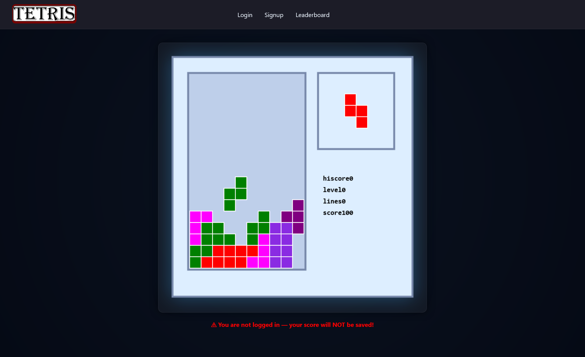

<!DOCTYPE html>
<html lang="en">
<head>
  <meta charset="UTF-8" />
  <title>Website-Game-DBMGNT</title>
  
</head>
<body>
<h1>Website-Game-DBMGNT</h1>
This project is a website that hosts a tetris game and can update user info on the connected database which is deployed via Railway. The focus of this project is not the game on the site nor the site itself. The game code is a slightly modified version of RosettaCode's javascript implementation of the game <a href="https://rosettacode.org/wiki/Tetris/JavaScript">Tetris</a>. The CSS styling is made by ChatGPT as to save time for the focus of the project; Creating a schema, connnecting the schema to the front end, and manipulating the data in several ways (INSERT, UPDATE, DELETE).

    Note: UPDATE DML yet to be implemented

<pre>

</pre>

<h2>Application Features</h2>

<h3>User</h3>

The user can play a game of Tetris but if not logged in then the game will not save the score. If a user wants their score to be saved then they will need to make an account and login. Once the user logs in they will have access to a user page and their scores will be saved. On the user page they can delete any one of their scores if they so choose to, the user will also be able to logout (of course).

<h3>Leaderboard</h3> Scores are submitted when a user loses, the score shows the user who achieved the score, the time, lines cleared, level reached, and rank. It shows the top 25 user scores, that means any one user can only have one score on the leaderboard (their top scores)

    This project is a work-in-progress and as such not all desired features may be implemented at the time of reading.

</body>