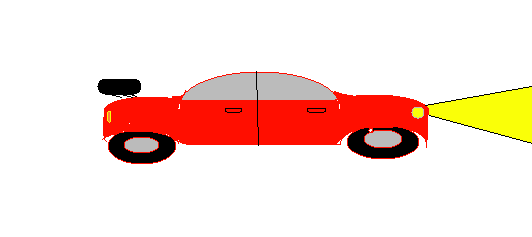

<h1>Website-Game-DBMGNT</h1>
This project is a website that hosts a tetris game on it and it can update user info on the connected database (add more text at some point)

<h2>Tasks Done</h2>
<ul>
    <li>Finish project feature list and scope
    <li>Set up Github repo
    <li>Add login page and sign up page (does nothing right now)
    <li>Link the login pages on the main page
    <li>Create ER diagram and relational schema
    <li>Add canvas to display game
    <li>Create Database Table
    <li>Implement falling blocks
    <li>Add scoring
    <li>Build basic UI for site
    <li>Fix clipping issues
</ul>

<h2>Tasks To Do</h2>
<ul>
    <li>Return top 10 scores
    <li>Display leaderboard UI on site with fetched data from scores API
    <li>Style leaderboard table
    <li>Make game over state and have it call score API
    <li>Implement register pages that add to user table and compare from user table
    <li>Implement password hashing
    <li>Make it so only logged in users can submit to leaderboard
    <li>Add working logout button
    <li>Implement line clearing and more points when that happens
    <li>Implement Tetrises
    <li>Implement rotation of blocks
</ul>

<h2>Tasks Update</h2>
<ul>
    <li>Fix annoying issue with the canvas moving as score increases
    <li>Fix broken register pages UI and remove forgot password
    <li>Add more UI elements so it's not to barren
</ul>

<h3>Images to depict my vision for the end of project</h3>

What the project is like right now  

What is will be after completing all tasks 

